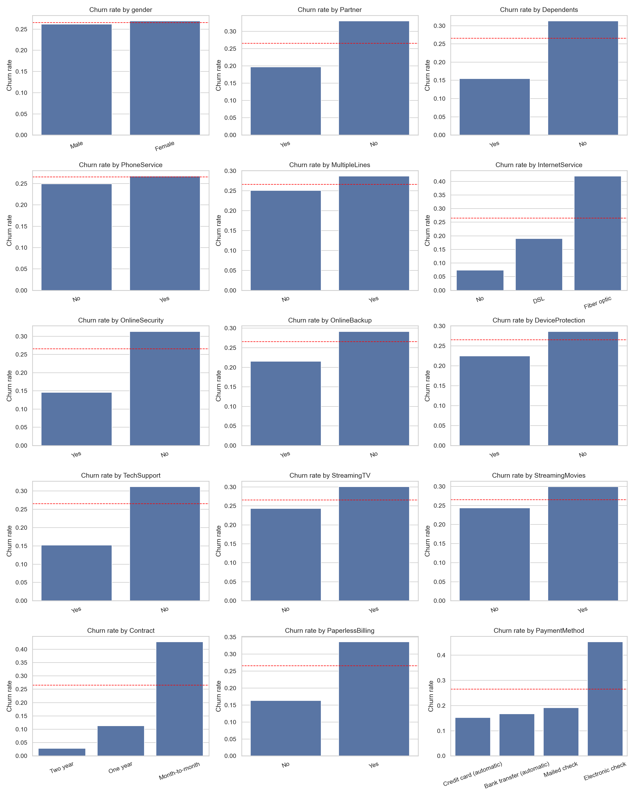
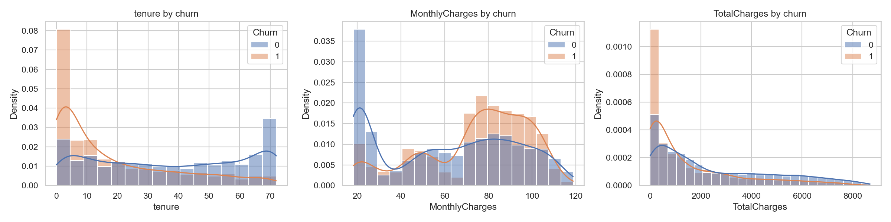
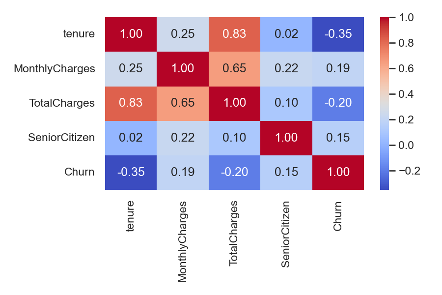
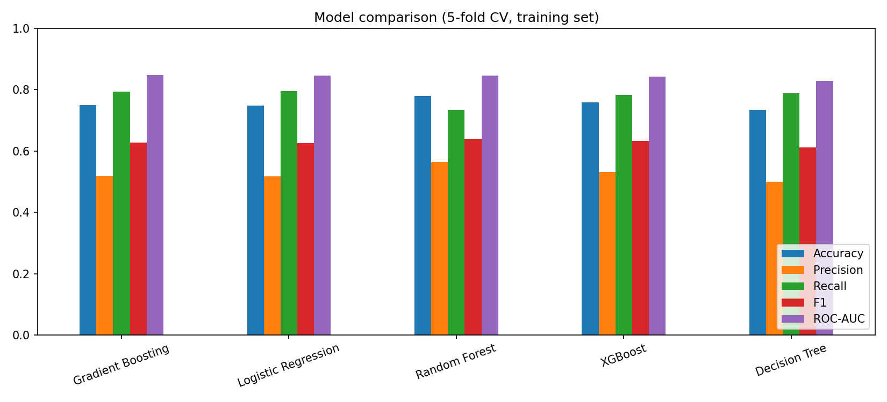
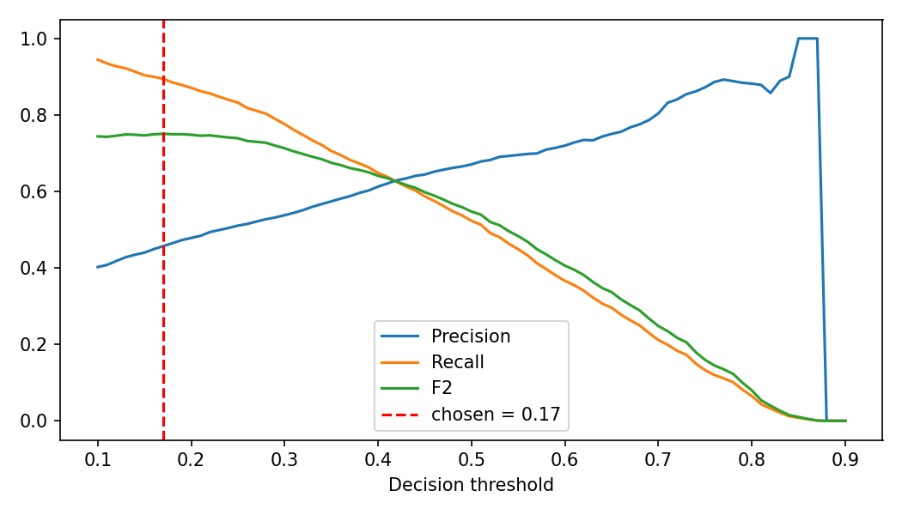
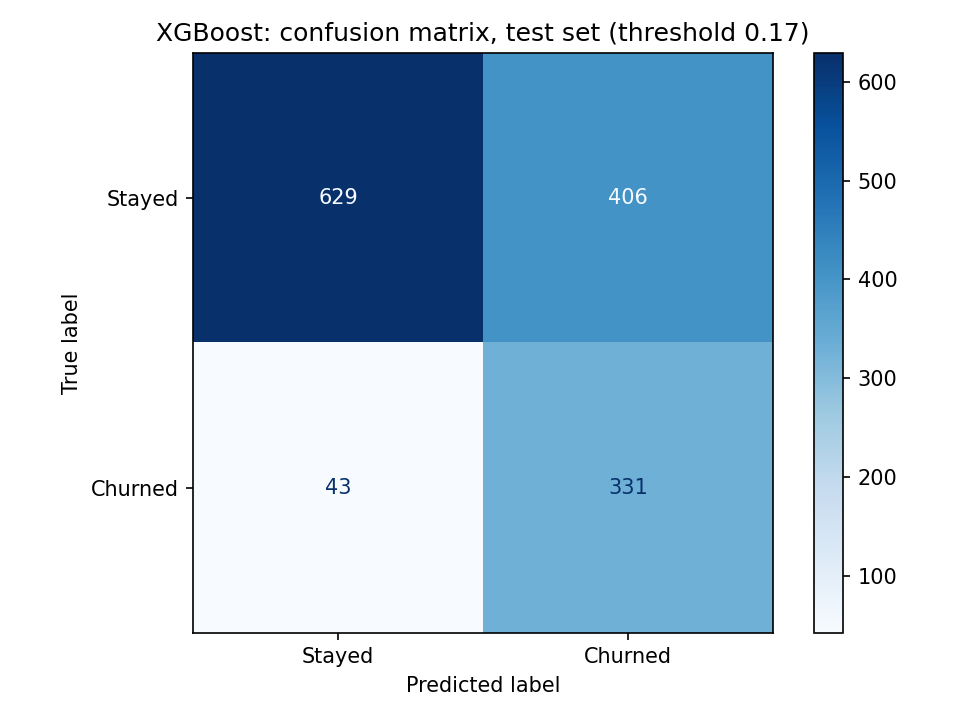
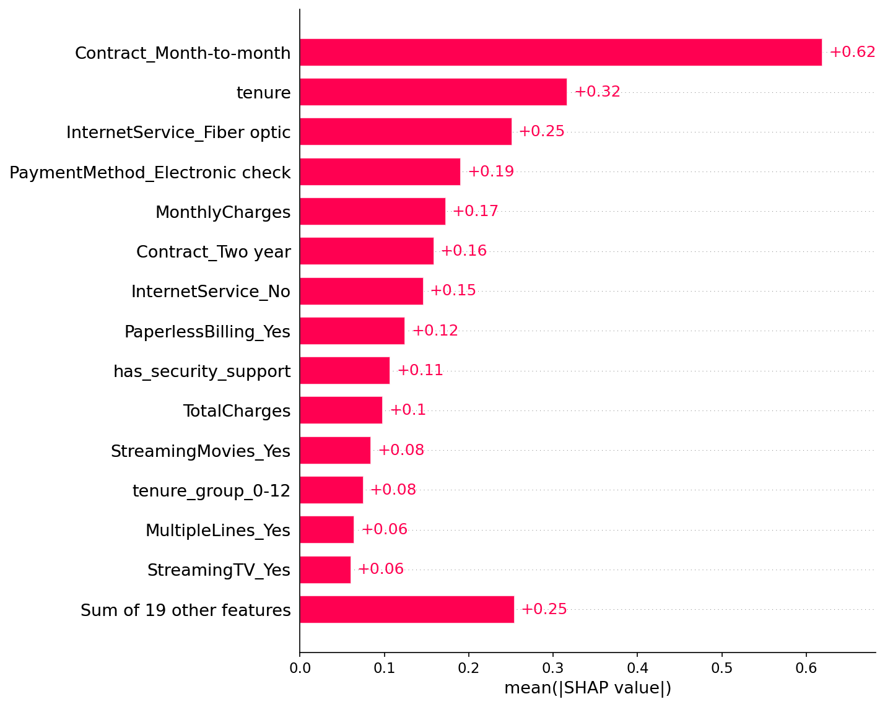
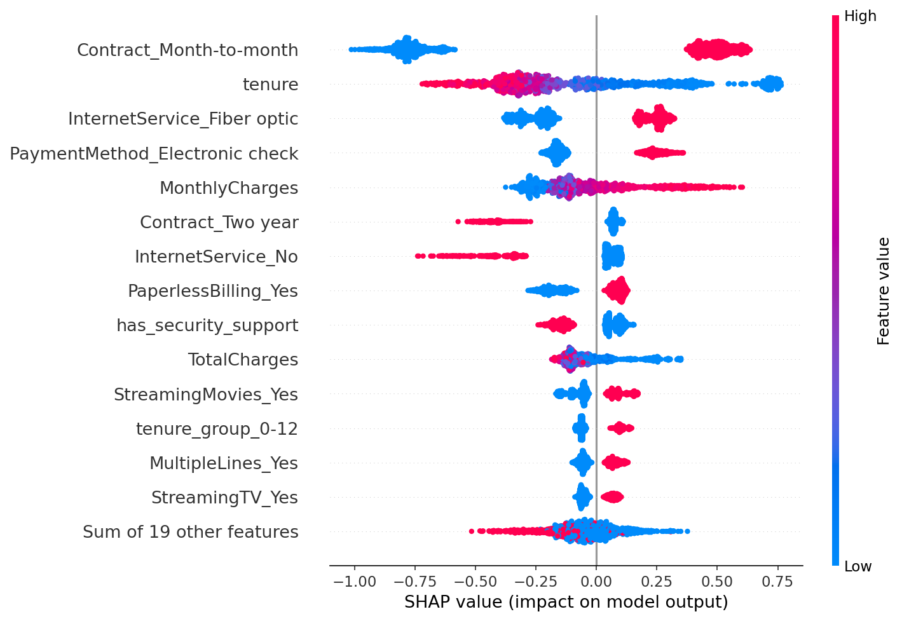
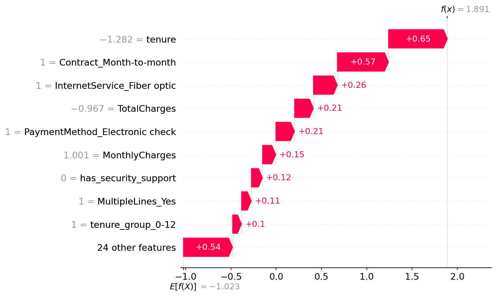

# AI-Powered Customer Churn Prediction & Retention System


An end-to-end machine learning system that learns from historical telecom customer data, predicts which customers are likely to leave, and explains why, so a retention team can act before the customer cancels.

## Table of Contents
1. [Results at a Glance](#results-at-a-glance)
2. [Project Overview](#project-overview)
3. [Business Problem](#business-problem)
4. [Objectives](#objectives)
5. [Dataset](#dataset)
6. [Technologies](#technologies)
7. [Project Structure](#project-structure)
8. [Methodology](#methodology)
9. [EDA Findings](#eda-findings)
10. [Feature Engineering](#feature-engineering)
11. [Train/Test Split and Preprocessing](#traintest-split-and-preprocessing)
12. [Model Development](#model-development)
13. [Model Comparison](#model-comparison)
14. [Tuning and Final Model](#tuning-and-final-model)
15. [Evaluation Results](#evaluation-results)
16. [Explainability](#explainability)
17. [Key Insights and Retention Strategies](#key-insights-and-retention-strategies)
18. [Installation](#installation)
19. [Usage](#usage)
20. [Limitations](#limitations)
21. [Future Improvements](#future-improvements)
22. [Author](#author)

## Results at a Glance

| Item | Result |
|---|---|
| Final model | XGBoost (tuned) |
| Cross-validated ROC-AUC | 0.850 |
| Test ROC-AUC (1,409 unseen customers) | 0.848 |
| Optimised for | Recall (F2 score) |
| Decision threshold | 0.17 (default 0.50 caught only 51% of churners) |
| Recall on the test set | 88.5% (331 of 374 churners caught) |
| Precision on the test set | 44.9% |
| Strongest churn driver | Month-to-month contract |

At the tuned threshold the model catches about 89% of churners by contacting about 52% of customers, and the customers it flags are about 1.7 times more likely to churn than a randomly chosen customer (44.9% vs 26.5% base rate).

## Project Overview

The project takes a raw customer dataset through cleaning, exploratory analysis, feature engineering, model training, honest evaluation, and interpretation. Five classification algorithms are compared fairly, the three strongest are tuned, and the best model is selected, threshold-tuned for recall, evaluated once on held-out data, and explained with SHAP.

## Business Problem

Churn is expensive. Every customer who leaves takes recurring revenue with them, and replacing that customer normally costs more than keeping them would have. The hard part is timing: by the moment a customer cancels, the chance to intervene has already gone. A business needs to know who is at risk while there is still time to act, and why they are at risk, so that the retention offer fits the reason.

This project translates historical customer records into forward-looking risk scores that a retention team can work from.

## Objectives

- Understand and analyse customer behaviour data
- Clean and preprocess the dataset
- Perform exploratory data analysis and identify the factors associated with churn
- Perform feature engineering
- Train multiple classification models and compare them fairly
- Select and justify a final model
- Generate customer churn probabilities and identify high-risk customers
- Provide interpretable, explainable insights
- Turn findings into concrete retention hypotheses

## Dataset

**Source:** IBM Telco Customer Churn dataset, Kaggle: [`blastchar/telco-customer-churn`](https://www.kaggle.com/datasets/blastchar/telco-customer-churn)

7,043 customers, 21 columns, one row per customer. The target `Churn` is binary, with 26.5% churners (1,869) and 73.5% non-churners (5,174), so the classes are imbalanced.

| Group | Columns |
|---|---|
| Identifier | `customerID` (dropped, no predictive value) |
| Demographics | `gender`, `SeniorCitizen`, `Partner`, `Dependents` |
| Account | `tenure` (months), `Contract`, `PaperlessBilling`, `PaymentMethod` |
| Services | `PhoneService`, `MultipleLines`, `InternetService`, `OnlineSecurity`, `OnlineBackup`, `DeviceProtection`, `TechSupport`, `StreamingTV`, `StreamingMovies` |
| Billing | `MonthlyCharges`, `TotalCharges` |
| Target | `Churn` (Yes/No) |

**Data quality issues found and handled:**
- `TotalCharges` was stored as text. 11 blank values all belonged to customers with `tenure = 0` (not yet billed), so they were set to 0.
- "No internet service" and "No phone service" were collapsed to "No" in seven service columns, since `InternetService` and `PhoneService` already carry that information.
- No duplicate rows and no other missing values.
- **Leakage check:** every feature would be known before a customer churns, so none were excluded for leakage.

## Technologies

| Purpose | Tools |
|---|---|
| Language | Python 3.12 |
| Data handling | Pandas, NumPy |
| Visualisation | Matplotlib, Seaborn, Plotly |
| Modelling | Scikit-learn, XGBoost |
| Explainability | SHAP |
| Environment | Jupyter Notebook, Git/GitHub |

## Project Structure

```
churn-prediction/
├── data/
│   ├── raw/            # original CSV (not tracked; download from Kaggle)
│   └── processed/      # telco_clean.csv, telco_features.csv
├── notebooks/
│   ├── 01_data_understanding.ipynb
│   ├── 02_data_cleaning.ipynb
│   ├── 03_eda.ipynb
│   ├── 04_feature_engineering.ipynb
│   └── 05_modelling.ipynb      # split, models, tuning, evaluation, SHAP
├── src/                # reusable code
├── models/
│   └── churn_model.joblib      # pipeline + XGBoost + tuned threshold
├── reports/            # figures and result tables
├── app/                # prediction interface / API
├── README.md
└── requirements.txt
```

## Methodology

```mermaid
flowchart TB
    subgraph P1["Phase 1: Data foundation"]
        A["Raw data<br/>Telco churn, 7,043 customers x 21 columns"]
        B["Cleaning<br/>Fix TotalCharges, merge redundant categories,<br/>encode target, drop customerID"]
        C["Exploratory analysis<br/>Churn vs every feature, segments, correlations"]
        D["Feature engineering<br/>num_addons, has_security_support,<br/>auto_pay, tenure_group"]
        A -->|"leakage check"| B --> C -->|"findings drive new features"| D
    end

    subgraph P2["Phase 2: Split before fitting"]
        S["Stratified 80/20 split<br/>random_state = 42"]
        TR["Training set<br/>5,634 rows, 26.5% churn"]
        TE["Test set<br/>1,409 rows, 26.5% churn<br/>locked until final evaluation"]
        S --> TR
        S --> TE
    end

    subgraph P3["Phase 3: Model selection (training data only)"]
        PRE["Preprocessing pipeline<br/>scale numerics, one-hot encode categoricals<br/>refitted inside every CV fold"]
        M["Train 5 models<br/>Logistic Regression, Decision Tree, Random Forest,<br/>Gradient Boosting, XGBoost"]
        CV["Compare fairly<br/>same folds, same seed, 5-fold stratified CV<br/>Accuracy, Precision, Recall, F1, ROC-AUC"]
        CHK["Diagnostics<br/>class weighting effect,<br/>decision tree overfitting"]
        TUNE["Tune top 3 models<br/>RandomizedSearchCV, 20 iterations,<br/>scored by ROC-AUC"]
        SEL["Select final model<br/>XGBoost, CV ROC-AUC 0.850"]
        PRE --> M --> CV
        CV --> CHK
        CV --> TUNE --> SEL
    end

    subgraph P4["Phase 4: Decision threshold (training data only)"]
        OOF["Out-of-fold predicted probabilities"]
        THR["Maximise F2 (recall weighted 2x)<br/>Threshold = 0.17"]
        OOF -->|"a missed churner costs more than a false alarm"| THR
    end

    subgraph P5["Phase 5: Final evaluation (test set used once)"]
        FIT["Refit final model on full training set"]
        EVAL["Evaluate on unseen test set<br/>Recall 88.5%, Precision 44.9%, ROC-AUC 0.848"]
        CM["Confusion matrix<br/>331 caught, 43 missed, 406 false alarms"]
        FIT --> EVAL --> CM
    end

    subgraph P6["Phase 6: Insight and delivery"]
        SHAP["SHAP explainability<br/>global drivers and per-customer explanations"]
        BI["Business insights<br/>risk segments and retention hypotheses"]
        SAVE["Saved artifact<br/>churn_model.joblib: pipeline, XGBoost, threshold"]
        APP["Prediction interface<br/>FastAPI and web UI"]
        SHAP --> BI
        SHAP --> SAVE --> APP
    end

    D --> S
    TR --> PRE
    SEL --> OOF
    THR --> FIT
    TE -.->|"used exactly once"| EVAL
    CM --> SHAP

    classDef data fill:#e8f1fb,stroke:#2b6cb0,color:#1a202c
    classDef model fill:#e6f6ec,stroke:#2f855a,color:#1a202c
    classDef eval fill:#fff4e0,stroke:#c05621,color:#1a202c
    classDef lock fill:#fde8e8,stroke:#c53030,color:#1a202c
    classDef out fill:#f3e8ff,stroke:#6b46c1,color:#1a202c
    class A,B,C,D,S,TR data
    class PRE,M,CV,CHK,TUNE,SEL,OOF,THR model
    class FIT,EVAL,CM eval
    class TE lock
    class SHAP,BI,SAVE,APP out
```



Principles followed throughout:
- **Split before fitting.** Scaling and encoding are learned from the training set only, inside each model's pipeline.
- **Fair comparison.** Every model uses the same preprocessing, the same folds, and the same random seed (42).
- **Test set used once.** Model selection and threshold tuning use training data only (cross-validation and out-of-fold predictions).
- **Accuracy is not the verdict.** A model that predicts "no churn" for everyone scores 73.5% accuracy and finds no at-risk customer, so models are judged on recall, precision, F1, and ROC-AUC.

## EDA Findings

Overall churn rate is 26.5%. Churn rate by every categorical feature (red dashed line is the overall rate):



| Factor | Finding |
|---|---|
| Contract | Month-to-month ~43% churn vs ~11% (one-year) and ~3% (two-year) |
| Internet service | Fiber optic ~42% vs ~19% (DSL) and ~7% (no internet) |
| Tenure | 47.4% churn in months 0-12, falling to 9.5% after 48 months |
| Payment method | Electronic check ~45% vs 15-19% for the other three methods |
| Seniors | 41.7% churn vs 23.6% for non-seniors |
| Paperless billing | ~34% churn vs ~16% without |
| Protective factors | OnlineSecurity, TechSupport, a partner, or dependents all sit clearly below average |
| No real effect | `gender` and `PhoneService` |

Churners are concentrated among new customers and higher monthly bills, while non-churners cluster at long tenure and low monthly charges:



Churn rate by contract and internet service shows where risk concentrates. Month-to-month fiber optic customers are the riskiest segment at 54.6%:

| Contract | DSL | Fiber optic | No internet |
|---|---|---|---|
| Month-to-month | 32.2% | **54.6%** | 18.9% |
| One year | 9.3% | 19.3% | 2.5% |
| Two year | 1.9% | 7.2% | 0.8% |

Correlations with churn: `tenure` -0.35, `TotalCharges` -0.20, `MonthlyCharges` 0.19, `SeniorCitizen` 0.15. `tenure` and `TotalCharges` are highly correlated with each other (0.83).



## Feature Engineering

Four features were derived from the EDA findings. All are computed row by row, so they cannot leak information from the test set.

| Feature | Definition | Churn rate by value |
|---|---|---|
| `num_addons` | Count of add-on services (security, backup, protection, support, two streaming services) | 0: 21.4%, 1: 45.8%, 2: 35.8%, 3: 27.4%, 4: 22.3%, 5: 12.4%, 6: 5.3% |
| `has_security_support` | Has OnlineSecurity or TechSupport | No: 33.4%, Yes: 17.1% |
| `auto_pay` | Pays by automatic bank transfer or credit card | No: 34.7%, Yes: 16.0% |
| `tenure_group` | Tenure bands: 0-12, 13-24, 25-48, 49-72 months | 47.4%, 28.7%, 20.4%, 9.5% |

The `num_addons = 0` group is low because it includes customers with no internet service, who rarely churn. Beyond that, churn falls steadily as customers take more add-ons.

## Train/Test Split and Preprocessing

- 80/20 stratified split on `Churn` (`random_state=42`): 5,634 training rows and 1,409 test rows, with a 26.5% churn rate in both.
- Preprocessing with a scikit-learn `ColumnTransformer`: standard scaling for numeric features, one-hot encoding for categorical features (`drop="if_binary"`, `handle_unknown="ignore"`), and pass-through for binary flags. The 23 input columns expand to 33 after encoding.
- The preprocessor is part of every model's pipeline, so it is refitted on training folds only during cross-validation.

## Model Development

Five classifiers were trained on identical inputs:

| Model | Role | Imbalance handling |
|---|---|---|
| Logistic Regression | Interpretable baseline | `class_weight="balanced"` |
| Decision Tree | Non-linear rules (depth-limited) | `class_weight="balanced"` |
| Random Forest | Robust ensemble | `class_weight="balanced"` |
| Gradient Boosting | Sequential boosting | Sample weights |
| XGBoost | Regularised boosting | `scale_pos_weight` |

## Model Comparison

5-fold stratified cross-validation on the training set:

| Model | Accuracy | Precision | Recall | F1 | ROC-AUC |
|---|---|---|---|---|---|
| Gradient Boosting | 0.750 | 0.519 | 0.793 | 0.627 | 0.847 |
| Logistic Regression | 0.748 | 0.517 | 0.795 | 0.626 | 0.846 |
| Random Forest | 0.780 | 0.565 | 0.734 | 0.639 | 0.846 |
| XGBoost | 0.759 | 0.532 | 0.783 | 0.633 | 0.843 |
| Decision Tree (depth-limited) | 0.735 | 0.500 | 0.788 | 0.612 | 0.828 |



**Findings**
- The four strongest models are effectively tied on ROC-AUC (0.843-0.847), and the simple Logistic Regression baseline is not beaten by the more complex models.
- **Effect of class weighting** (Logistic Regression): recall rose from 0.538 to 0.795 while precision fell from 0.665 to 0.517. Accuracy dropped from 0.805 to 0.748 and ROC-AUC did not change (0.846). Weighting moves the decision line and catches more churners at the cost of more false alarms.
- **Effect of removing the Decision Tree depth limit:** training recall reached 0.999 but cross-validated recall was only 0.492, and ROC-AUC fell from 0.828 to 0.658. This is severe overfitting, so a depth limit is required.
- Random Forest has the highest precision (0.565) and F1 (0.639) but the lowest recall of the top four (0.734).

## Tuning and Final Model

The three strongest models were tuned with `RandomizedSearchCV` (20 iterations, 5-fold stratified CV, scored by ROC-AUC). Class weights were removed for this stage, because imbalance is handled by threshold tuning instead.

| Tuned model | Best CV ROC-AUC |
|---|---|
| **XGBoost** | **0.8502** |
| Gradient Boosting | 0.8499 |
| Random Forest | 0.8481 |
| Logistic Regression (baseline, untuned) | 0.8460 |

**Final model: XGBoost**, selected for the highest cross-validated ROC-AUC. Best parameters: `n_estimators=200`, `learning_rate=0.03`, `max_depth=3`, `subsample=0.85`, `colsample_bytree=0.6`, `min_child_weight=5`, `reg_lambda=10`.

The winning settings are shallow and heavily regularised, which shows that simple models generalise best on this data. The gain over the untuned baseline is only +0.004, so the dataset has a limited signal ceiling and better data would help more than a more complex model. The final choice was made on the highest score; the top three models are within noise of each other.

## Evaluation Results

**Metric optimised: recall (via the F2 score).** A missed churner costs the customer's revenue, while a false alarm costs only a retention offer, so recall is weighted twice as heavily as precision. The decision threshold (**0.17**) was tuned on out-of-fold training predictions only.



Test set results (1,409 customers, evaluated once):

| Threshold | Accuracy | Precision | Recall | F1 | ROC-AUC |
|---|---|---|---|---|---|
| 0.50 (default) | 0.802 | 0.664 | 0.513 | 0.579 | 0.848 |
| **0.17 (tuned)** | 0.681 | 0.449 | **0.885** | 0.596 | 0.848 |



| | Predicted: stayed | Predicted: churned |
|---|---|---|
| **Actually stayed** | 629 | 406 (false alarms) |
| **Actually churned** | 43 (missed) | 331 (caught) |

**What this means**
- The model catches 331 of 374 churners (88.5%), compared with 51% at the default threshold.
- It flags 737 customers (52% of the base). 45% of those flagged actually churn, which is about 1.7 times the 26.5% base rate.
- The cost is 406 false alarms, so retention offers should be cheap to send.
- Test ROC-AUC (0.848) matches cross-validation (0.850), so there is no sign of overfitting or leakage.
- Accuracy falls from 80% to 68% by design; it is context, never the verdict.

## Explainability

SHAP (`TreeExplainer`) was applied to the final XGBoost model on the test set.



| Rank | Feature | Mean \|SHAP\| | Effect |
|---|---|---|---|
| 1 | Contract: month-to-month | 0.619 | raises churn |
| 2 | Tenure | 0.317 | lowers churn |
| 3 | Internet service: fiber optic | 0.251 | raises churn |
| 4 | Payment method: electronic check | 0.191 | raises churn |
| 5 | Monthly charges | 0.173 | raises churn |
| 6 | Contract: two year | 0.159 | lowers churn |
| 7 | Internet service: none | 0.146 | lowers churn |
| 8 | Paperless billing | 0.125 | raises churn |
| 9 | Has security or tech support | 0.107 | lowers churn |
| 10 | Total charges | 0.098 | lowers churn |

Each dot below is one customer; red is a high feature value and position shows whether it pushed that customer's risk up (right) or down (left):



Per-customer explanation for the highest-risk customer in the test set (churn probability 0.869):



The SHAP drivers agree with the EDA, which is evidence that the model learned real patterns rather than noise. Contract type is by far the strongest driver, about twice as influential as tenure. The two contract rows and the two internet-service rows are different levels of the same variable, and `TotalCharges` mostly acts as a proxy for long tenure.

## Key Insights and Retention Strategies

**High-risk customer profile (plain language):** a recent customer (first year) on a month-to-month contract, with fiber optic internet, paying by electronic check with paperless billing, a relatively high monthly bill, and no security or tech support add-ons. Seniors also churn more.

**Segments where churn concentrates**

| Segment | Churn rate |
|---|---|
| Month-to-month + fiber optic | 54.6% |
| Tenure 0-12 months | 47.4% |
| Electronic check payers | ~45% |
| Month-to-month contract (all) | ~43% |
| Senior citizens | 41.7% |
| No security/tech support | 33.4% |

**Retention strategies (hypotheses to test, not proven causes)**

| Driver | Proposed action | Cost to test |
|---|---|---|
| Month-to-month contract | Offer a discount or bonus to move flagged customers to a one-year plan | Low: A/B test on the flagged group |
| First-year tenure | Onboarding check-ins and a welcome offer in months 1-3 | Low to moderate |
| Electronic check payment | Small bill credit for switching to automatic payment | Low |
| No security/tech support | Free trial of security or support add-ons | Low to moderate |
| Fiber optic churn | Review fiber pricing, service quality, and competitor offers | High: needs real investment and root-cause work |
| High monthly charges | Plan right-sizing or targeted price review | Moderate to high |

> [!IMPORTANT]
> Feature importance describes association, not causation. The strategies above are hypotheses worth testing with controlled experiments before committing budget. See [Limitations](#limitations).

## Installation

```bash
# 1. Clone the repository
git clone https://github.com/mzainnasir010/churn-prediction.git
cd churn-prediction

# 2. Create and activate a virtual environment (Windows)
python -m venv venv
venv\Scripts\activate

# 3. Install pinned dependencies
pip install -r requirements.txt
```

Download the dataset from [Kaggle](https://www.kaggle.com/datasets/blastchar/telco-customer-churn) and place it at:

```
data/raw/WA_Fn-UseC_-Telco-Customer-Churn.csv
```

Tested with Python 3.12.

## Usage

**Reproduce the analysis:** run the notebooks in order (`01` to `05`) from the `notebooks/` folder.

```bash
jupyter notebook
```

**Score a customer with the saved model:**

```python
import joblib
import pandas as pd

bundle = joblib.load("models/churn_model.joblib")
pipeline, threshold = bundle["pipeline"], bundle["threshold"]

customer = pd.DataFrame([{
    "gender": "Female", "SeniorCitizen": 0, "Partner": "No", "Dependents": "No",
    "tenure": 3, "PhoneService": "Yes", "MultipleLines": "No",
    "InternetService": "Fiber optic", "OnlineSecurity": "No", "OnlineBackup": "No",
    "DeviceProtection": "No", "TechSupport": "No", "StreamingTV": "No",
    "StreamingMovies": "No", "Contract": "Month-to-month", "PaperlessBilling": "Yes",
    "PaymentMethod": "Electronic check", "MonthlyCharges": 75.0, "TotalCharges": 225.0,
    "num_addons": 0, "has_security_support": 0, "auto_pay": 0, "tenure_group": "0-12",
}])

proba = pipeline.predict_proba(customer)[0, 1]
print(f"Churn probability: {proba:.1%} | flagged as at risk: {proba >= threshold}")
```

> [!NOTE]
> The model expects the four engineered columns (`num_addons`, `has_security_support`, `auto_pay`, `tenure_group`) as well as the raw columns. Loading the model requires the same library versions listed in `requirements.txt`.

## Limitations

- **Association, not causation.** The model and SHAP show what is linked to churn, not what causes it.
- **Single snapshot dataset.** There is no time dimension, so the model was validated on a random split rather than on future customers.
- **Modest signal ceiling.** ROC-AUC plateaus around 0.85 across every model family, so the data limits performance more than the algorithm does.
- **Precision is 45%.** More than half of flagged customers would have stayed, so the approach only pays off when retention offers are cheap.
- **No cost data.** The 0.17 threshold assumes a missed churner is worth about twice a false alarm's cost. With real offer and customer-lifetime-value figures the threshold should be re-tuned.
- **Correlated features.** `tenure`, `tenure_group`, and `TotalCharges` share importance, so individual rankings should be read together.
- **Fairness.** `SeniorCitizen` and `gender` are demographic features; any real deployment should include a fairness and compliance review.

## Future Improvements

- Prediction interface: a FastAPI endpoint and a simple web UI for the retention team
- Risk tiers (low, medium, high) with justified thresholds
- Automated retention recommendations that map each customer's dominant SHAP driver to a suggested action
- Cost-sensitive threshold using real offer costs and customer lifetime value
- Probability calibration so scores can be read as true likelihoods
- Time-based validation and drift monitoring on newer data
- Evaluation on additional churn datasets (banking, SaaS) to test generalisation

## Author

**Muhammad Zain Nasir**
[GitHub](https://github.com/mzainnasir010) | [LinkedIn](https://www.linkedin.com/in/muhammadin-zain-nasir/) | [Portfolio](https://muhammad-zain-nasir.vercel.app/)
