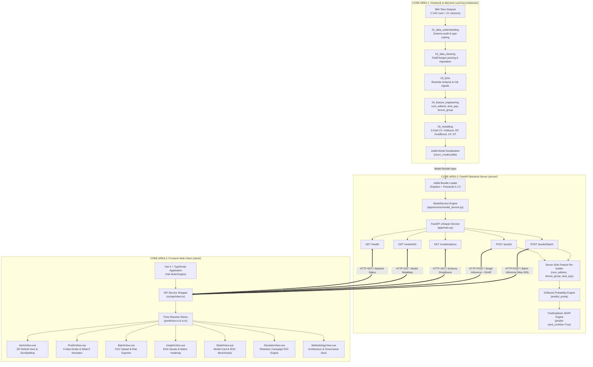
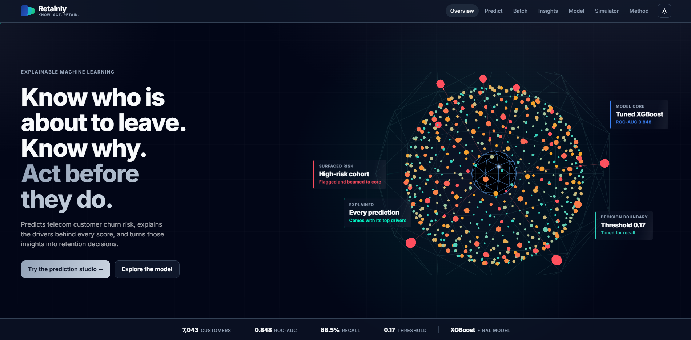
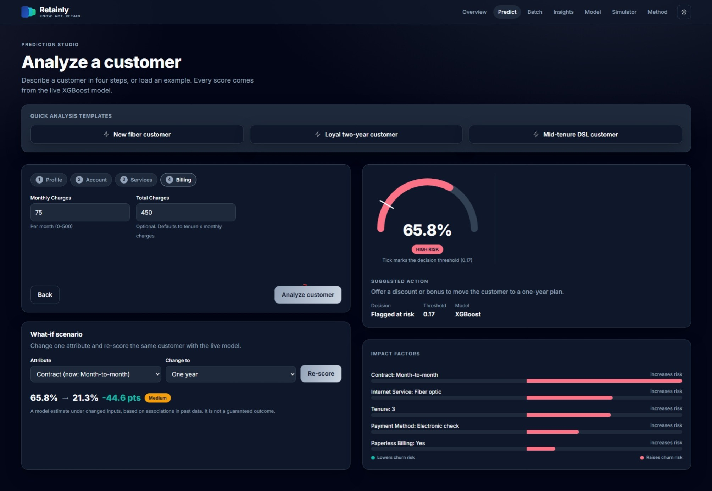
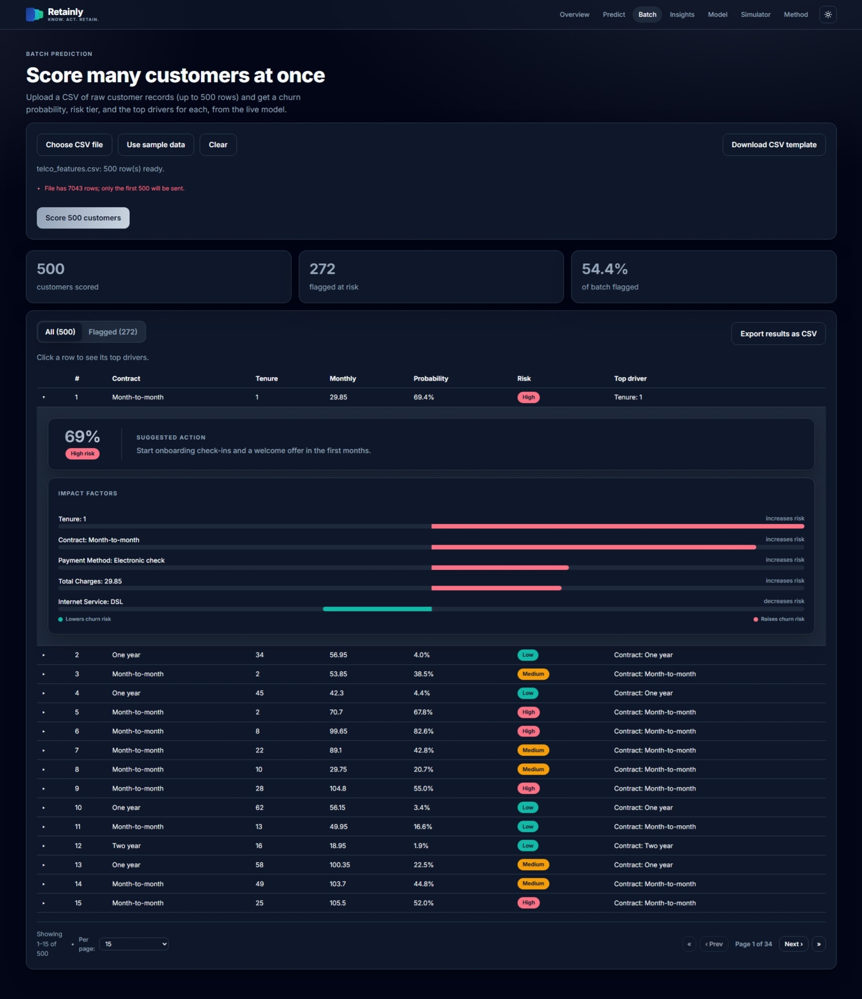
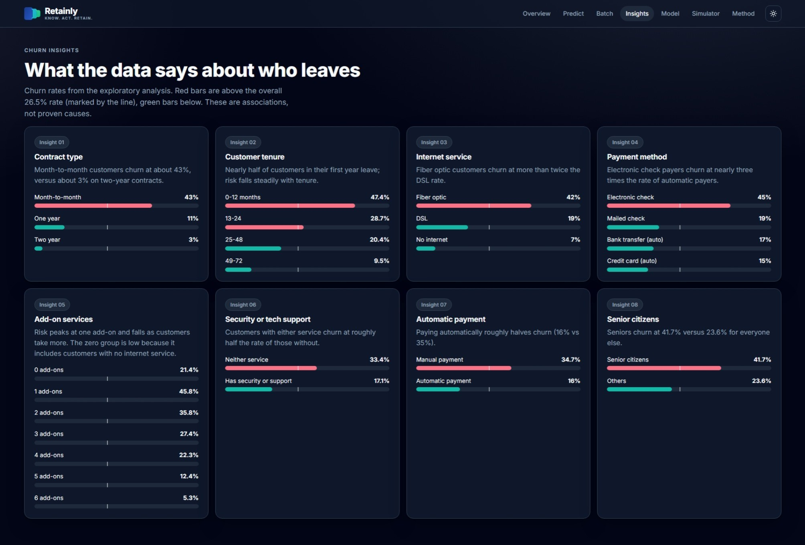
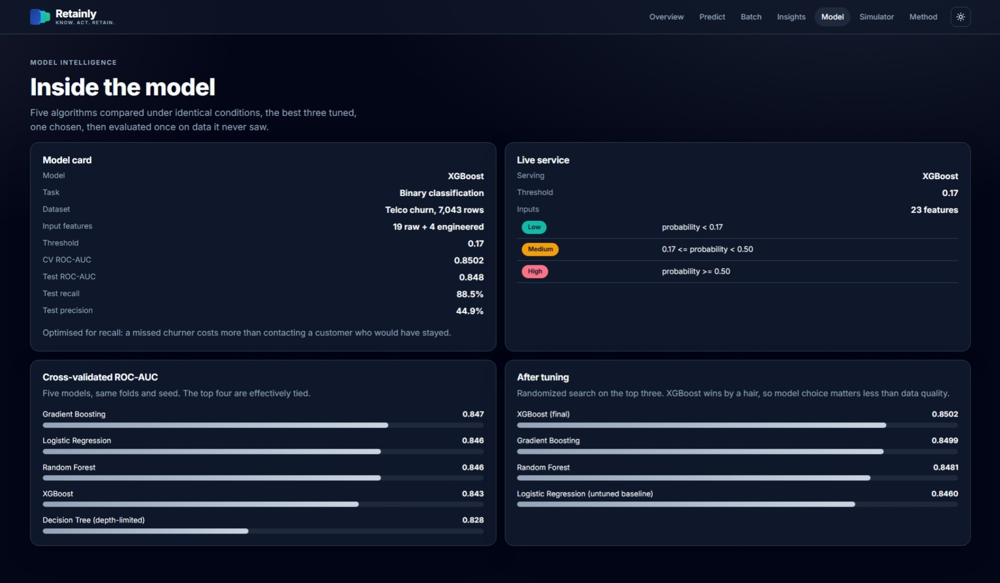
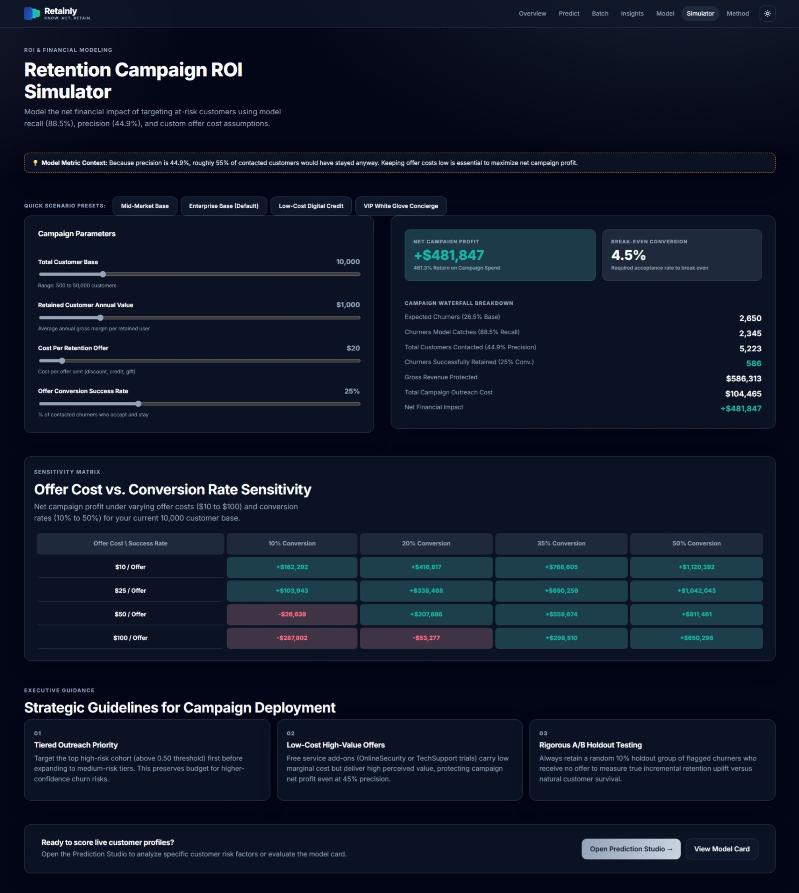
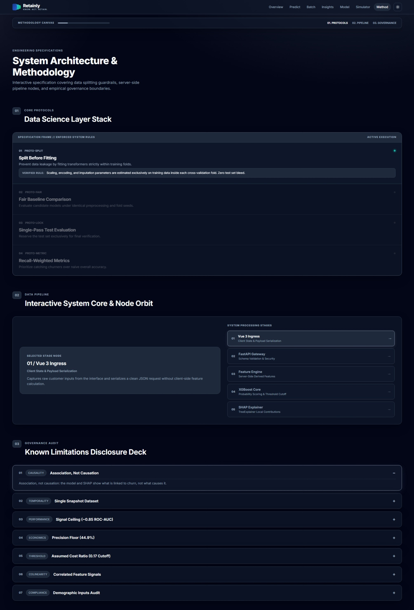

# AI-Powered Customer Churn Prediction & Retention System


**Live Demo:** [Retainly](https://retainlyy.vercel.app/) ↗

An end-to-end, production-grade machine learning application designed to predict customer churn risk from telecom customer records, quantify individual risk drivers using SHAP feature attribution, and empower retention teams through a full suite of interactive web applications (Single Customer Prediction Studio, Batch CSV Processing Studio, Retention ROI Campaign Simulator, Churn Insights Heatmaps, Model Intelligence Deck, and Scrollytelling System Architecture).

---

## Table of Contents

1. [Title & Executive Summary](#ai-powered-customer-churn-prediction--retention-system)
2. [Overview](#full-system-architecture)
3. [Business Problem](#business-problem--strategic-objectives)
4. [Objectives](#strategic-objectives)
5. [Dataset](#dataset-overview)
6. [Technologies](#technologies--system-stack)
7. [Methodology](#core-area-1-notebook--machine-learning-notebook)
8. [EDA Findings](#exploratory-data-analysis-eda-insights)
9. [Model Development](#jupyter-notebook-sequence)
10. [Model Comparison](#model-benchmarks--cross-validation)
11. [Evaluation Results](#decision-threshold-tuning-recall-vs-precision)
12. [Key Insights](#shap-explainability--risk-attribution)
13. [Installation](#installation--setup)
14. [Usage](#usage--running-the-complete-system)
15. [Screenshots & Visual Demos](#screenshots--visual-demos)
16. [Future Improvements & Governance](#future-improvements--governance)

---

## Results at a Glance

| Metric / Specification | Value / Result | Notes / Context |
|---|---|---|
| **Production Model** | Tuned XGBoost Classifier | Selected via 5-fold Stratified CV |
| **Cross-Validated ROC-AUC** | **0.850** | Evaluated on 5,634 training records |
| **Held-Out Test ROC-AUC** | **0.848** | Evaluated on 1,409 unseen test records |
| **Tuned Decision Threshold** | **0.17** | Optimized for F2 score (Recall weighted 2x over Precision) |
| **Test Set Recall** | **88.5%** | Catches **331 of 374** actual churners in test set |
| **Test Set Precision** | **44.9%** | 737 total customers flagged; 45% true churn rate in risk pool |
| **Default (0.50) Recall** | **51.3%** | Standard 0.50 threshold missed 182 actual churners ( caught only 192 ) |
| **Top Churn Driver** | Month-to-Month Contract | Mean SHAP impact: **+0.619** log-odds risk increase |

---

## Full System Architecture


```mermaid
flowchart TB
    subgraph AREA1["CORE AREA 1: Notebook & Machine Learning (notebook/)"]
        RAW["IBM Telco Dataset<br/>(7,043 rows × 21 columns)"]
        N1["01_data_understanding<br/>Schema audit & type casting"]
        N2["02_data_cleaning<br/>TotalCharges parsing & imputation"]
        N3["03_EDA<br/>Bivariate analysis & risk signals"]
        N4["04_feature_engineering<br/>num_addons, auto_pay, tenure_group"]
        N5["05_modelling<br/>5-Fold CV: XGBoost, RF, GradBoost, LR, DT"]
        EXPORT["Joblib Model Serialization<br/>(churn_model.joblib)"]

        RAW --> N1 --> N2 --> N3 --> N4 --> N5 --> EXPORT
    end

    subgraph AREA2["CORE AREA 2: FastAPI Backend Server (server/)"]
        FASTAPI["FastAPI Lifespan Service<br/>(app/main.py)"]
        MODEL_SVC["ModelService Engine<br/>(app/services/model_service.py)"]
        LOADER["Joblib Bundle Loader<br/>(Pipeline + Threshold 0.17)"]
        TRANSFORMER["Server-Side Feature Re-builder<br/>(num_addons, tenure_group, auto_pay)"]
        XGB_ENGINE["XGBoost Probability Engine<br/>(predict_proba)"]
        SHAP_ENGINE["TreeExplainer SHAP Engine<br/>(predict pred_contribs=True)"]
        
        EP_HEALTH["GET /health"]
        EP_INFO["GET /model/info"]
        EP_OPT["GET /model/options"]
        EP_PRED["POST /predict"]
        EP_BATCH["POST /predict/batch"]

        EXPORT -.->|"Model Bundle Input"| LOADER
        LOADER --> MODEL_SVC --> FASTAPI
        FASTAPI --> EP_HEALTH & EP_INFO & EP_OPT & EP_PRED & EP_BATCH
        EP_PRED & EP_BATCH --> TRANSFORMER --> XGB_ENGINE --> SHAP_ENGINE
    end

    subgraph AREA3["CORE AREA 3: Frontend Web Client (client/)"]
        VUE_APP["Vue 3 + TypeScript Application<br/>(Vite Build Engine)"]
        API_LAYER["API Service Wrapper<br/>(src/api/client.ts)"]
        PINIA_STORE["Pinia Reactive Stores<br/>(prediction.ts & ui.ts)"]
        
        VIEW_HOME["HomeView.vue<br/>3D Particle Hero & Scrollytelling"]
        VIEW_PRED["PredictView.vue<br/>4-Step Studio & What-If Simulator"]
        VIEW_BATCH["BatchView.vue<br/>CSV Upload & Risk Exporter"]
        VIEW_INSIGHTS["InsightsView.vue<br/>EDA Visuals & Matrix Heatmap"]
        VIEW_MODEL["ModelView.vue<br/>Model Card & ROC Benchmarks"]
        VIEW_SIM["SimulatorView.vue<br/>Retention Campaign ROI Engine"]
        VIEW_METH["MethodologyView.vue<br/>Architecture & Governance Deck"]

        VUE_APP --> API_LAYER --> PINIA_STORE
        PINIA_STORE --> VIEW_HOME & VIEW_PRED & VIEW_BATCH & VIEW_INSIGHTS & VIEW_MODEL & VIEW_SIM & VIEW_METH
    end

    EP_HEALTH <===>|"HTTP GET / Network Status"| API_LAYER
    EP_INFO <===>|"HTTP GET / Model Metadata"| API_LAYER
    EP_OPT <===>|"HTTP GET / Schema Dropdowns"| API_LAYER
    EP_PRED <===>|"HTTP POST / Single Inference + SHAP"| API_LAYER
    EP_BATCH <===>|"HTTP POST / Batch Inference (Max 500)"| API_LAYER
```

---

## Business Problem & Strategic Objectives

### Business Problem
Customer churn causes immediate subscription revenue decay. In the telecommunications sector, acquiring a replacement customer costs 5x to 25x more than retaining an existing subscriber. 

Traditional retention efforts suffer from three operational flaws:
1. **Late Detection:** Identifying churn risk after a customer files a cancellation request is rarely effective.
2. **Generic Interventions:** Broad discount campaigns waste budget on satisfied customers or offer incentives that fail to target individual risk drivers (e.g., offering price discounts to customers who actually require technical support).
3. **Sub-optimal Thresholding:** Default machine learning models set decision thresholds at `0.50`, which severely penalizes Recall. Missing an actual churner forfeits hundreds or thousands of dollars in lifetime value, whereas a false alarm costs only a minor retention campaign incentive.

### Strategic Objectives
- **Build an End-to-End ML Pipeline:** Clean raw telecom data, perform leakage-free preprocessing, engineer business features, and train competitive ML models.
- **Optimize for Business ROI (Recall Focus):** Adjust decision thresholds using the $F_2$ metric to capture **>85% of actual churners**.
- **Serve Real-Time Model Explanations:** Build a FastAPI REST API that returns churn probabilities, risk tiers (`Low`, `Medium`, `High`), and top 5 individual SHAP risk drivers per customer.
- **Provide Actionable Interfaces:** Deliver a modern Vue 3 web interface with instant scenario testing ("What-If"), CSV batch processing, campaign ROI calculators, and scroll-linked technical documentation.

---

## Dataset Overview

**Dataset Source:** IBM Telco Customer Churn dataset ([`blastchar/telco-customer-churn`](https://www.kaggle.com/datasets/blastchar/telco-customer-churn))

- **Total Records:** 7,043 telecom customers
- **Total Attributes:** 21 attributes (19 raw features, 1 identifier, 1 binary target)
- **Target Variable:** `Churn` (`Yes`: 1,869 [26.5%], `No`: 5,174 [73.5%])

| Attribute Category | Attributes / Features | Format / Data Types |
|---|---|---|
| **Customer ID** | `customerID` | String (dropped before ML fitting) |
| **Demographics** | `gender`, `SeniorCitizen`, `Partner`, `Dependents` | Categorical / Binary (0, 1) |
| **Account Profile** | `tenure` (months), `Contract`, `PaperlessBilling`, `PaymentMethod` | Numeric / Categorical |
| **Subscribed Services**| `PhoneService`, `MultipleLines`, `InternetService`, `OnlineSecurity`, `OnlineBackup`, `DeviceProtection`, `TechSupport`, `StreamingTV`, `StreamingMovies` | Categorical strings (`Yes`, `No`, `No internet service`) |
| **Financial Signals** | `MonthlyCharges`, `TotalCharges` | Continuous numeric float values |

---

## Technologies & System Stack

```
   DATA SCIENCE & ML           BACKEND REST API             FRONTEND CLIENT
 ┌───────────────────┐       ┌───────────────────┐       ┌───────────────────┐
 │ Python 3.12       │       │ FastAPI 0.115     │       │ Vue 3.5           │
 │ pandas & NumPy    │  ───► │ Uvicorn ASGI      │  ───► │ TypeScript 5.3    │
 │ scikit-learn 1.6  │       │ Pydantic v2       │       │ Vite 5            │
 │ XGBoost           │       │ joblib            │       │ Pinia State       │
 │ SHAP (Tree)       │       │ CORSMiddleware    │       │ Three.js 3D       │
 └───────────────────┘       └───────────────────┘       └───────────────────┘
```

---

## Project Directory Structure

```
churn-prediction/
├── notebook/                             # CORE AREA 1: Machine Learning & Notebooks
│   ├── data/
│   │   ├── raw/                          # Original WA_Fn-UseC_-Telco-Customer-Churn.csv
│   │   └── processed/                    # Cleaned & transformed train/test datasets
│   ├── models/
│   │   └── churn_model.joblib            # Serialized XGBoost pipeline & decision threshold
│   ├── notebooks/
│   │   ├── 01_data_understanding.ipynb   # Initial inspection, schema validation, data types
│   │   ├── 02_data_cleaning.ipynb        # TotalCharges parsing, missing value handling
│   │   ├── 03_EDA.ipynb                  # Exploratory Data Analysis & visual charts
│   │   ├── 04_feature_engineering.ipynb  # Creation of num_addons, auto_pay, tenure_group
│   │   └── 05_modelling.ipynb            # Model comparison, tuning, evaluation & SHAP
│   └── reports/                          # Generated metrics CSVs and plot artifacts
│       ├── model_comparison.csv
│       ├── final_test_results.csv
│       ├── confusion_matrix.png
│       ├── threshold_tradeoff.png
│       └── shap_beeswarm.png
│
├── server/                               # CORE AREA 2: FastAPI REST API Service
│   ├── app/
│   │   ├── core/
│   │   │   ├── __init__.py
│   │   │   └── config.py                 # Paths, CORS origins, risk thresholds
│   │   ├── routes/
│   │   │   ├── __init__.py
│   │   │   ├── health.py                 # GET /health
│   │   │   ├── model.py                  # GET /model/info & GET /model/options
│   │   │   └── prediction.py             # POST /predict & POST /predict/batch
│   │   ├── schemas/
│   │   │   ├── __init__.py
│   │   │   ├── customer.py               # Pydantic CustomerInput validation schema
│   │   │   └── prediction.py             # Driver, PredictionResult, BatchResponse schemas
│   │   ├── services/
│   │   │   ├── __init__.py
│   │   │   └── model_service.py          # Model inference, feature builder & SHAP engine
│   │   ├── __init__.py
│   │   └── main.py                       # FastAPI initialization & lifespan handler
│   ├── models/                           # Bundled standalone model artifacts for cloud deployment
│   │   ├── churn_model.joblib
│   │   └── final_test_results.csv
│   ├── requirements.txt                  # Server dependencies (FastAPI, uvicorn, xgboost, joblib)
│   └── venv/                             # Virtual environment
│
├── client/                               # CORE AREA 3: Vue 3 Single-Page Web Application
│   ├── src/
│   │   ├── api/
│   │   │   └── client.ts                 # Fetch API wrapper with timeout and retry logic
│   │   ├── components/
│   │   │   ├── hero/                     # 3D Three.js particle canvas & floating cards
│   │   │   ├── AppNav.vue                # Navigation header
│   │   │   ├── AppFooter.vue             # Footer component
│   │   │   ├── BarList.vue               # Insights horizontal bar comparisons
│   │   │   ├── CountUp.vue               # Animated numeric counter
│   │   │   ├── ExplainabilityScrolly.vue # SHAP waterfall scrollytelling component
│   │   │   ├── ImpactBars.vue            # Risk contribution indicators (+ / -)
│   │   │   ├── MethodologyScrolly.vue    # System architecture scrollytelling deck
│   │   │   ├── PipelineTimeline.vue      # Step-by-step pipeline timeline
│   │   │   ├── RiskGauge.vue             # Semi-circular SVG churn probability gauge
│   │   │   ├── StudioShowcaseScrolly.vue # Interactive prediction studio showcase
│   │   │   ├── ThresholdCompare.vue      # 2x2 confusion matrix comparison component
│   │   │   └── ThresholdScrolly.vue      # Threshold tuning scrollytelling component
│   │   ├── data/                         # Static EDA data constants & segment matrix
│   │   ├── stores/
│   │   │   ├── prediction.ts             # Pinia store for customer form & prediction state
│   │   │   └── ui.ts                     # Pinia store for drawer states & notification toasts
│   │   ├── styles/                       # CSS design system, typography, glassmorphism
│   │   ├── types/
│   │   │   └── index.ts                  # TypeScript interfaces (Customer, Prediction, Driver)
│   │   ├── views/
│   │   │   ├── HomeView.vue              # Overview & Scrollytelling hero
│   │   │   ├── PredictView.vue           # Single Customer Prediction & What-If Studio
│   │   │   ├── BatchView.vue             # Batch CSV Upload & Risk Exporter Studio
│   │   │   ├── InsightsView.vue          # EDA Insights & Segment Risk Heatmap Matrix
│   │   │   ├── ModelView.vue             # Model Card, CV Leaderboard & Confusion Matrix
│   │   │   ├── SimulatorView.vue         # Retention Campaign Financial ROI Calculator
│   │   │   └── MethodologyView.vue       # System Architecture & Governance Deck
│   │   ├── App.vue                       # Root Vue layout component
│   │   └── main.ts                       # Vue app entrypoint
│   ├── package.json                      # Client dependencies (Vue 3, Vite, Pinia, Three.js)
│   └── vite.config.ts                    # Vite build configuration
│
├── README.md                             # Complete System Documentation
└── requirements.txt                      # Root Machine Learning environment requirements
```

---

## Core Area 1: Notebook & Machine Learning (`notebook/`)

### Jupyter Notebook Sequence

The machine learning workflow is organized sequentially in `notebook/notebooks/`:

1. **`01_data_understanding.ipynb`:** Inspects raw dataset dimensions (7,043 × 21), checks column names, verifies primitive data types, and audits target balance (`Churn`: 26.5%).
2. **`02_data_cleaning.ipynb`:** Identifies 11 blank space strings (`" "`) in `TotalCharges`. Converts `TotalCharges` to numeric float and imputes missing values using `tenure × MonthlyCharges` (where `tenure=0`). Drops the non-predictive `customerID` column.
3. **`03_EDA.ipynb`:** Conducts comprehensive bivariate analysis comparing categorical variables against churn rates and evaluating numerical distributions (`tenure`, `MonthlyCharges`, `TotalCharges`).
4. **`04_feature_engineering.ipynb`:** Engineers 4 business features and validates their statistical correlation with churn risk.
5. **`05_modelling.ipynb`:** Performs stratified 80/20 train/test split, builds scikit-learn ColumnTransformer pipelines, evaluates 5 algorithms via 5-fold cross-validation, tunes decision thresholds for $F_2$ Recall optimization, computes SHAP feature attributions, and serializes the final pipeline artifact.

### Data Cleaning & Leakage Prevention

- **Strict Stratified Split:** Split into an 80% training set (5,634 rows) and a 20% held-out test set (1,409 rows) before computing standard scalers or feature encoders.
- **Pipeline Embedding:** Scalers (`StandardScaler`) and encoders (`OneHotEncoder(handle_unknown="ignore")`) are wrapped inside scikit-learn `Pipeline` objects. Preprocessing parameters are fit strictly on training folds during 5-fold CV to prevent data leakage.

### Exploratory Data Analysis (EDA) Insights

- **Baseline Churn Rate:** 26.5% overall churn rate across 7,043 customer accounts.
- **Contract Type Friction:** Month-to-month subscribers churn at **42.7%**, compared to 11.3% for 1-year contracts and 2.8% for 2-year contracts.
- **Internet Service Impact:** Fiber optic customers churn at **41.9%**, compared to 19.0% for DSL users and 7.4% for customers with no internet service.
- **Early Lifecycle Vulnerability:** Customers in their first 12 months churn at **47.4%**, dropping steadily to 9.5% for customers with >48 months tenure.
- **Payment Method Risk:** Electronic check users churn at **45.3%**, compared to ~15–19% for automated payment methods (bank transfer / credit card).

### Feature Engineering Specifications

Four domain-specific features were created:

| Feature Name | Type | Formula / Logic | Business Objective |
|---|---|---|---|
| `num_addons` | Integer (0 to 6) | $\sum (\text{OnlineSecurity}, \text{OnlineBackup}, \text{DeviceProtection}, \text{TechSupport}, \text{StreamingTV}, \text{StreamingMovies} == \text{'Yes'})$ | Measures product adoption depth. Customers with 3+ add-ons churn significantly less. |
| `has_security_support` | Binary (0 / 1) | $\text{OnlineSecurity} == \text{'Yes'} \lor \text{TechSupport} == \text{'Yes'}$ | Identifies customers with proactive technical safety nets. |
| `auto_pay` | Binary (0 / 1) | $\text{'automatic'} \in \text{PaymentMethod}$ | Distinguishes seamless auto-recurring billing from manual payment friction. |
| `tenure_group` | Categorical | `0-12`, `13-24`, `25-48`, `49-72` months | Bins continuous tenure into operational lifecycle cohorts. |

### Model Benchmarks & Cross-Validation

Five classifiers were evaluated using 5-Fold Stratified Cross-Validation on the training dataset (5,634 records):

| Model Algorithm | CV ROC-AUC | CV Recall | CV Precision | CV F1 Score | Notes |
|---|---|---|---|---|---|
| **XGBoost (Tuned)** | **0.850** | **0.783** | **0.532** | **0.633** | **Best overall ROC-AUC & non-linear handling** |
| **Gradient Boosting** | 0.847 | 0.793 | 0.519 | 0.627 | Strong baseline, slightly slower training |
| **Logistic Regression** | 0.846 | 0.795 | 0.517 | 0.626 | Linear baseline, highly interpretable |
| **Random Forest** | 0.846 | 0.734 | 0.565 | 0.639 | Higher precision, lower recall |
| **Decision Tree (max_depth=5)** | 0.828 | 0.788 | 0.500 | 0.612 | Low-complexity baseline model |

### Decision Threshold Tuning (Recall vs. Precision)

Standard model evaluation defaults to a `0.50` probability cutoff. However, in churn prediction, **a false negative (missing an actual churner) costs ~2x to 5x more than a false positive (sending a retention offer to a customer who wasn't going to churn)**.

Using out-of-fold predictions, the decision threshold was tuned to **0.17** to maximize the $F_2$ score:

$$F_2 = \frac{5 \cdot \text{Precision} \cdot \text{Recall}}{4 \cdot \text{Precision} + \text{Recall}}$$

**Held-Out Test Set Performance (1,409 Unseen Customers - 374 Actual Churners):**

| Threshold Setting | Accuracy | Precision | Recall | F1 Score | Actual Churners Caught | Missed Churners |
|---|---|---|---|---|---|---|
| **Default Threshold (0.50)** | 80.2% | 66.4% | 51.3% | 57.9% | 192 of 374 | **182 missed** |
| **Tuned Threshold (0.17)** | **68.1%** | **44.9%** | **88.5%** | **59.6%** | **331 of 374** | **43 missed** |

> **Key Takeaway:** Lowering the threshold to **0.17** increased churn capture from **51.3% to 88.5%**, catching **139 additional churners** who would have otherwise left undetected.

### SHAP Explainability & Risk Attribution

SHAP (`TreeExplainer`) was integrated to provide global feature importance and local instance-level explainability:

- **Global Top Churn Drivers:**
  1. `Contract: Month-to-month` (+0.619 mean log-odds impact) — Strongest positive churn signal.
  2. `tenure` (-0.317 mean log-odds impact) — Primary protective retention anchor.
  3. `InternetService: Fiber optic` (+0.251 mean log-odds impact) — High risk signal (pricing/service friction).
  4. `PaymentMethod: Electronic check` (+0.191 mean log-odds impact) — High manual payment friction.
  5. `MonthlyCharges` (+0.173 mean log-odds impact) — Continuous pricing pressure.
  6. `Contract: Two year` (-0.159 mean log-odds impact) — Primary long-term lock-in anchor.

### Model Artifact Serialization

The final fitted model is serialized to `notebook/models/churn_model.joblib` containing a dictionary bundle:

```python
{
    "pipeline": fitted_scikit_learn_pipeline,  # Preprocessing ColumnTransformer + XGBoost model
    "threshold": 0.17,                          # Tuned optimal decision threshold
    "model_name": "XGBoost Classifier",
    "features": feature_names_list
}
```

---

## Core Area 2: FastAPI Backend Server (`server/`)

### Architecture & Lifespan State Management

The backend is built as a stateless, asynchronous REST API using **FastAPI** and **Uvicorn**.

It uses FastAPI's `lifespan` context manager (`app/main.py`) to load the serialized `churn_model.joblib` file into server memory upon startup, ensuring zero per-request disk load latency:

```python
@asynccontextmanager
async def lifespan(app: FastAPI):
    model_service.load()  # Load joblib bundle into memory
    yield
```

### ModelService Core Engine

Located in `server/app/services/model_service.py`, `ModelService` handles pipeline initialization, raw input transformation, probability scoring, risk tiering, and SHAP calculation:

1. **Feature Origin Resolution (`_origin`):** Maps one-hot encoded dummy column names back to their raw parent features (e.g., mapping `Contract_Month-to-month` back to `Contract`).
2. **On-the-Fly Feature Re-construction (`_to_frame`):** Translates incoming customer JSON into pandas DataFrames, cleans strings (e.g., mapping `"No internet service"` to `"No"` for service indicators), computes default `TotalCharges = tenure * MonthlyCharges` if missing, and engineers `num_addons`, `has_security_support`, `auto_pay`, and `tenure_group`.
3. **Risk Tier Assignment (`_tier`):**
   - **`Low`:** Probability < `0.17`
   - **`Medium`:** `0.17` $\le$ Probability < `0.50`
   - **`High`:** Probability $\ge$ `0.50`

### On-the-Fly SHAP Explanation Engine

To generate fast, instant SHAP attributions without heavy computational overhead, `ModelService` extracts the inner XGBoost booster from the scikit-learn pipeline and invokes native contribution prediction:

```python
raw_contribs = model.get_booster().predict(
    xgb.DMatrix(transformed_X), pred_contribs=True
)[:, :-1]
```

Contributions are aggregated by feature origin to return the **top 5 features** that increase or decrease churn risk for each customer.

### API Endpoints Reference

#### 1. `GET /health`
- **Description:** Verifies server status, model readiness, and API latency.
- **Response `200 OK`:**
```json
{
  "status": "ok",
  "model_loaded": true,
  "model": "XGBoost Classifier",
  "ms": 4
}
```

#### 2. `GET /model/info`
- **Description:** Returns model metadata, active decision threshold, risk tier definitions, and held-out test evaluation benchmarks.
- **Response `200 OK`:**
```json
{
  "model": "XGBoost Classifier",
  "decision_threshold": 0.17,
  "input_features": 19,
  "risk_tiers": {
    "Low": "probability < 0.17",
    "Medium": "0.17 <= probability < 0.50",
    "High": "probability >= 0.50"
  },
  "test_set_evaluation": {
    "0.17_tuned": {
      "accuracy": 0.6813,
      "precision": 0.4491,
      "recall": 0.8850,
      "f1_score": 0.5959
    },
    "0.50_default": {
      "accuracy": 0.8020,
      "precision": 0.6644,
      "recall": 0.5134,
      "f1_score": 0.5792
    }
  }
}
```

#### 3. `GET /model/options`
- **Description:** Returns allowed values for all dropdown input fields (used dynamically by frontend form builders).
- **Response `200 OK`:**
```json
{
  "gender": ["Male", "Female"],
  "SeniorCitizen": [0, 1],
  "Partner": ["Yes", "No"],
  "Dependents": ["Yes", "No"],
  "PhoneService": ["Yes", "No"],
  "MultipleLines": ["Yes", "No", "No phone service"],
  "InternetService": ["DSL", "Fiber optic", "No"],
  "OnlineSecurity": ["Yes", "No", "No internet service"],
  "OnlineBackup": ["Yes", "No", "No internet service"],
  "DeviceProtection": ["Yes", "No", "No internet service"],
  "TechSupport": ["Yes", "No", "No internet service"],
  "StreamingTV": ["Yes", "No", "No internet service"],
  "StreamingMovies": ["Yes", "No", "No internet service"],
  "Contract": ["Month-to-month", "One year", "Two year"],
  "PaperlessBilling": ["Yes", "No"],
  "PaymentMethod": [
    "Electronic check",
    "Mailed check",
    "Bank transfer (automatic)",
    "Credit card (automatic)"
  ]
}
```

#### 4. `POST /predict`
- **Description:** Accepts a single customer record and returns churn probability, decision status, risk tier, and top 5 SHAP drivers.
- **Request Body:**
```json
{
  "gender": "Female",
  "SeniorCitizen": 0,
  "Partner": "No",
  "Dependents": "No",
  "tenure": 2,
  "PhoneService": "Yes",
  "MultipleLines": "No",
  "InternetService": "Fiber optic",
  "OnlineSecurity": "No",
  "OnlineBackup": "No",
  "DeviceProtection": "No",
  "TechSupport": "No",
  "StreamingTV": "No",
  "StreamingMovies": "No",
  "Contract": "Month-to-month",
  "PaperlessBilling": "Yes",
  "PaymentMethod": "Electronic check",
  "MonthlyCharges": 85.00,
  "TotalCharges": 170.00
}
```
- **Response `200 OK`:**
```json
{
  "churn_probability": 0.7842,
  "at_risk": true,
  "risk_tier": "High",
  "threshold": 0.17,
  "top_drivers": [
    {
      "feature": "Contract",
      "value": "Month-to-month",
      "contribution": 0.619,
      "direction": "increases risk"
    },
    {
      "feature": "tenure",
      "value": "2",
      "contribution": -0.317,
      "direction": "decreases risk"
    },
    {
      "feature": "InternetService",
      "value": "Fiber optic",
      "contribution": 0.251,
      "direction": "increases risk"
    },
    {
      "feature": "PaymentMethod",
      "value": "Electronic check",
      "contribution": 0.191,
      "direction": "increases risk"
    },
    {
      "feature": "MonthlyCharges",
      "value": "85.0",
      "contribution": 0.173,
      "direction": "increases risk"
    }
  ]
}
```

#### 5. `POST /predict/batch`
- **Description:** Accepts an array of up to 500 customer records and returns batch prediction results and summary counters.
- **Request Body:**
```json
{
  "customers": [
    { /* Customer 1 */ },
    { /* Customer 2 */ }
  ]
}
```
- **Response `200 OK`:**
```json
{
  "count": 2,
  "flagged": 1,
  "results": [
    {
      "churn_probability": 0.7842,
      "at_risk": true,
      "risk_tier": "High",
      "threshold": 0.17,
      "top_drivers": [ /* Drivers array */ ]
    },
    {
      "churn_probability": 0.0412,
      "at_risk": false,
      "risk_tier": "Low",
      "threshold": 0.17,
      "top_drivers": [ /* Drivers array */ ]
    }
  ]
}
```

### Server Configuration (`config.py`)

Configured via environment variables with fallback defaults in `server/app/core/config.py`:

- `MODEL_PATH`: Absolute path to `churn_model.joblib`.
- `METRICS_PATH`: Path to `final_test_results.csv`.
- `CORS_ORIGINS`: Allowed client origins (`http://localhost:5173`, `http://127.0.0.1:5173`).
- `HIGH_RISK_THRESHOLD`: `0.50` (defines boundary for `High` risk tier).
- `MAX_BATCH_SIZE`: `500` records per batch payload.
- `TOP_DRIVERS`: `5` features per SHAP explanation payload.

### Server Setup & Local Execution

```bash
# 1. Navigate to server directory
cd server

# 2. Create and activate virtual environment
python -m venv venv

# On Windows (PowerShell):
.\venv\Scripts\Activate.ps1

# On Linux / macOS:
source venv/bin/activate

# 3. Install requirements
pip install -r requirements.txt

# 4. Launch FastAPI ASGI server on port 8000
uvicorn app.main:app --reload --port 8000
```

- **Interactive Swagger Documentation:** `http://127.0.0.1:8000/docs`
- **ReDoc Documentation:** `http://127.0.0.1:8000/redoc`

---

## Core Area 3: Vue 3 Single-Page Web Client (`client/`)

### Frontend Architecture & Scrollytelling Engine

The client application is built with **Vue 3 (Composition API `<script setup>`)**, **TypeScript 5.3**, **Vite**, **Pinia**, **Vue Router 4**, and **Three.js**.

- **Scroll-Linked Scrollytelling:** Implements non-intrusive scroll triggers via `requestAnimationFrame` and `getBoundingClientRect` for buttery smooth 60fps animations without external heavy dependencies.
- **3D Interactive Scene:** Renders an interactive 3D particle landscape in the hero section using Three.js with raycasting interaction.

### API Service & Error Handling Layer

Located in `client/src/api/client.ts`, the frontend API service features:
- **Automatic Retries & Timeouts:** Uses `AbortSignal.timeout(15000)` and single-retry fallback on network dropouts.
- **Pydantic Validation Parsing:** Converts HTTP `422 Unprocessable Entity` details into clear error strings.
- **Type Safety:** Returns typed promises mapped to explicit interfaces defined in `client/src/types/index.ts`.

### State Management (Pinia Stores)

1. **`usePredictionStore` (`src/stores/prediction.ts`):** Manages active customer form state, single prediction results, historical predictions log, batch upload customer array, and batch predictions.
2. **`useUiStore` (`src/stores/ui.ts`):** Controls drawer modal visibility, active navigation state, toast notifications, and global theme configurations.

### Design System & Layout Geometry

- **Global Container Geometry:** All 7 page views inherit standardized container margins (`padding: 0 3vw`) to guarantee aligned horizontal boundaries across desktop and mobile screens.
- **Visual Aesthetic:** Minimalist slate monochrome design system (`#090d16` background, slate cards, muted accents, crisp typography) with subtle glassmorphism backdrop blurs.

### Complete Application Views Breakdown

#### 1. Overview & Scrollytelling (`HomeView.vue`)
- **3D Particle Canvas Hero:** Interactive Three.js canvas featuring floating risk metric cards and live status indicators.
- **Animated CountUp Metrics:** Real-time count-up animation for cross-validated ROC-AUC (0.850), recall rate (88.5%), and tuned threshold (0.17).
- **Pipeline Timeline (`PipelineTimeline.vue`):** Interactive alternating timeline detailing data ingestion, feature engineering, model fitting, and API serving steps.
- **Threshold Scrollytelling (`ThresholdScrolly.vue`):** Interactive scroll module comparing the default `0.50` threshold with the tuned `0.17` threshold.
- **Explainability Scrollytelling (`ExplainabilityScrolly.vue`):** Flipped scroll-driven SHAP driver visualization with sticky waterfall graphics on the left and narrative text blocks on the right.
- **Studio Showcase (`StudioShowcaseScrolly.vue`):** Full-width preview section demonstrating single customer scoring and batch features.

#### 2. Single Prediction Studio (`PredictView.vue`)
- **4-Step Form Wizard:** Guided input sequence covering Demographics, Account Profile, Subscribed Services, and Financials with inline validation.
- **Persona Quick-Presets:** One-click instant population buttons (*Low-Risk Loyal*, *High-Risk Month-to-Month*, *New Fiber Optic*, *Automated Saver*).
- **Semi-Circular Risk Gauge (`RiskGauge.vue`):** SVG risk gauge displaying continuous churn probability, threshold marker, and risk tier color code (`Low`: Green, `Medium`: Amber, `High`: Red).
- **What-If Scenario Simulator:** Interactive control panel allowing operators to adjust attributes (e.g. switching contract length or adding `TechSupport`) and instantly see updated churn probabilities and delta indicators without refilling forms.
- **SHAP Impact Bars (`ImpactBars.vue`):** Ranked breakdown showing top 5 features increasing risk (+) or decreasing risk (-).

#### 3. Batch CSV Processing (`BatchView.vue`)
- **Drag-and-Drop Uploader:** Accepts CSV files containing up to 500 customer rows.
- **Sample File Generator:** Built-in template downloader and 10-row sample generator for testing.
- **Tabular Data Table:** Sortable and searchable table with status badges (`Flagged at Risk` vs `Low Risk`).
- **Interactive Detail Drawer:** Clicking any table row opens a side drawer displaying full SHAP driver attributions for that customer.
- **One-Click Export:** Exports enriched CSV files containing raw customer fields alongside predicted probabilities, decision statuses, risk tiers, and top risk drivers.

#### 4. Churn Insights & Matrix (`InsightsView.vue`)
- **8 Exploratory Visual Modules:** Horizontal bar charts (`BarList.vue`) illustrating churn rate differentials across contract types, internet services, tenure bands, payment methods, and add-on counts.
- **Segment Churn Matrix:** Heatmap grid contrasting churn probability across Contract Type × Internet Service combinations (e.g., Month-to-Month + Fiber Optic = 54.6% churn rate).

#### 5. Model Intelligence & Card (`ModelView.vue`)
- **Standardized Model Card:** Detailed documentation covering model architecture, intended domain, training data distribution, and ethical boundary conditions.
- **Cross-Validation Leaderboard:** Comparative benchmark table displaying ROC-AUC, Recall, Precision, and F1 scores across 5 candidate algorithms.
- **Confusion Matrix Component (`ThresholdCompare.vue`):** Side-by-side 2x2 confusion matrices illustrating performance under the `0.50` default threshold vs `0.17` tuned threshold on the 1,409 held-out test records.

#### 6. Campaign ROI Simulator (`SimulatorView.vue`)
- **Interactive Financial Engine:** Real-time financial calculator with range sliders for:
  - Customer Cohort Size (100 to 10,000 customers)
  - Average Annual LTV ($300 to $3,000)
  - Retention Offer Unit Cost ($10 to $200)
  - Campaign Acceptance / Retention Success Rate (5% to 80%)
- **Preset Campaign Scenarios:** Quick-select presets (*Mid-Market Standard*, *Enterprise VIP*, *Low-Cost Digital Incentive*, *VIP White Glove Intervention*).
- **Real-Time Financial KPI Cards:** Displays Net Campaign Profit / Loss, Return on Investment (ROI %), Saved Revenue, and Total Campaign Execution Cost.
- **4x4 Sensitivity Matrix:** Financial grid evaluating Net ROI across varying offer costs ($10 to $100) and acceptance rates (10% to 50%).

#### 7. System Methodology (`MethodologyView.vue`)
- **Sticky Progress Dial & Navigation:** Real-time top progress bar and floating dial tracking scroll position through methodology sections.
- **Monolithic Specification Stack:** Detailed technical breakdown of feature transformation rules, model serialization protocols, and inference guarantees.
- **Pipeline Orbit Stage:** Interactive stage illustrating server processing nodes from request parsing to response construction.
- **Governance Accordion Deck:** Auto-collapsing disclosure deck detailing system limitations, drift assumptions, and human-in-the-loop guidelines.

### Client Setup & Build Commands

```bash
# 1. Navigate to client directory
cd client

# 2. Install dependencies
npm install

# 3. Start Vite local development server
npm run dev

# 4. Execute TypeScript validation and build production bundle
npm run build

# 5. Preview production build locally
npm run preview
```

- **Local Development Server:** `http://localhost:5173`

---

## Running the Complete System

To run the complete system locally, execute the backend server and frontend client in separate terminal windows:

```bash
# Terminal 1: Start FastAPI Server (Port 8000)
cd server
.\venv\Scripts\Activate.ps1   # On Windows
uvicorn app.main:app --reload --port 8000

# Terminal 2: Start Vue 3 Web Application (Port 5173)
cd client
npm run dev
```

## Installation & Setup

Please refer to the setup instructions under [Core Area 2: FastAPI Backend Server](#server-setup--local-execution) and [Core Area 3: Vue 3 Web Client](#client-setup--build-commands).

---

## Usage & Running the Complete System

To run the complete system locally, execute the backend server and frontend client in separate terminal windows:

```bash
# Terminal 1: Start FastAPI Server (Port 8000)
cd server
.\venv\Scripts\Activate.ps1   # On Windows
uvicorn app.main:app --reload --port 8000

# Terminal 2: Start Vue 3 Web Application (Port 5173)
cd client
npm run dev
```

Once both processes are active, navigate to `http://localhost:5173` in your browser.

---

## Screenshots & Visual Demos

**Live Application:** [Retainly Web App](https://retainly.zainnasir6921.workers.dev/)

### 1. Home Overview & Scrollytelling


### 2. Single Customer Prediction Studio


### 3. Batch CSV Processing Studio


### 4. Churn Insights & Segment Risk Heatmap


### 5. Model Intelligence & Performance Card


### 6. Retention Campaign ROI Simulator


### 7. System Architecture & Methodology Deck


---

## Future Improvements & Governance

1. **Correlation vs. Causation:** SHAP feature attributions represent statistical associations learned from historical customer data, not definitive causal mechanics. Retention interventions should be validated via randomized control trial (A/B) experiments.
2. **Dataset Scope & Cohort Drift:** Trained on IBM Telco snapshot data. Production deployments require continuous monitoring for data drift and periodic model re-training as customer behavior evolves.
3. **Precision Trade-Off Floor:** Operating at the tuned threshold (`0.17`) achieves **88.5% Recall** at the cost of **44.9% Precision**. Approximately 55% of flagged customers would not have churned even without an intervention. Retention offers must remain cost-effective so that unneeded incentives do not outweigh saved revenue.
4. **Human-in-the-Loop Oversight:** Predictions generated by this system should serve as decision-support guidance for customer success teams rather than trigger automated account cancellations or billing alterations without human review.
5. **Future Roadmap:**
   - Incorporate time-series survival analysis (e.g. Cox Proportional Hazards) to predict *when* a customer will churn in addition to probability.
   - Integrate automated A/B testing framework to track real-world retention campaign uplift over time.
   - Implement real-time WebSockets for streaming batch analytics on multi-thousand row datasets.

---

## Author

**Muhammad Zain Nasir**
[GitHub](https://github.com/mzainnasir010) | [LinkedIn](https://www.linkedin.com/in/muhammadin-zain-nasir/) | [Portfolio](https://www.mzainnasir.dev/)
